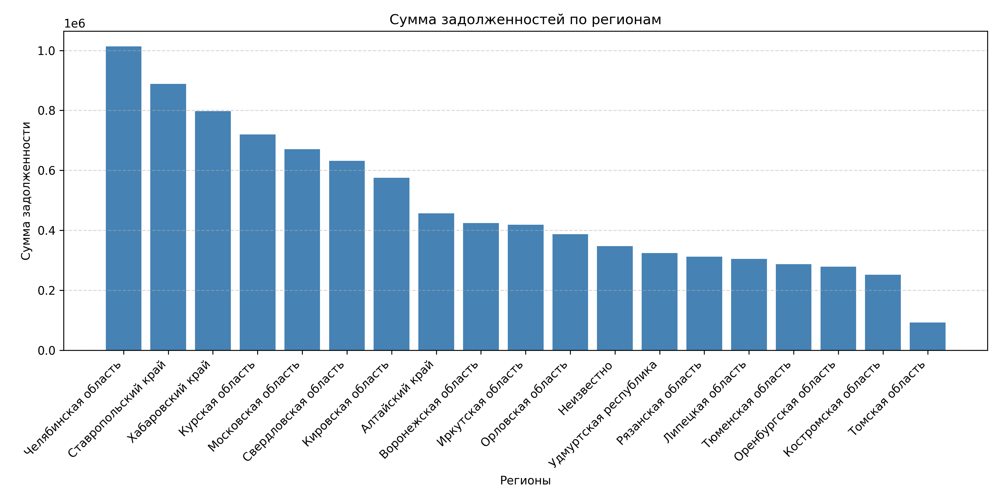
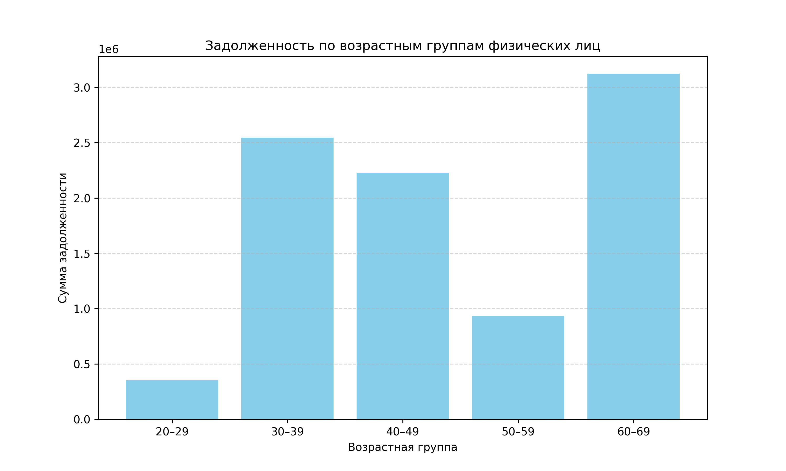

# Тестовое задание

Этот проект реализует процесс парсинга, хранения, анализа и визуализации данных по обязательствам физических лиц на основе XML-файлов.  
Включает в себя:

- Декодирование и парсинг XML
- Запись данных в базу данных SQLite
- Выполнение SQL-запросов для аналитики
- Построение графиков по регионам и возрастным группам

---

## Начало работы

### Требования

- Python 3.10 и выше
- SQLite3 (входит в стандартную библиотеку Python)
- Рекомендуется использование виртуального окружения

---

### Установка

#### 1. Клонируйте репозиторий:

```bash
git clone <URL вашего репозитория>
cd <название проекта>
```

#### 2. Создайте и активируйте виртуальное окружение:

```bash
python -m venv venv
source venv/bin/activate # Linux/macOS
venv\Scripts\activate # Windows
```

#### 3. Установите зависимости:

```bash
pip install -r requirements.txt
```

#### 4. Запуск приложения:

```bash
python main.py
```

Это выполнит:
- Инициализацию базы данных
- Парсинг XML-файлов из сырой директории
- Сохранение данных в базу
- Вывод аналитики в консоль
- Построение и сохранение графиков

## Структура проекта

```commandline
SovcombankTest/
├── core/    
│   ├── db/                                                         -- модуль взаимодействия с БД
│   │   ├── __init__.py                                             -- скрипт инициализации модуля
│   │   ├── connection.py                                           -- функции управления БД
│   │   └── schema.sql                                              -- SQL-скрипт создания сущностей БД
│   ├── models/                                                     -- модуль взаимодействия с моделями данных
│   │   └── __init__.py                                             
│   │   └── address.py                                              -- модель Address
│   │   └── bank.py                                                 -- модель Bank
│   │   └── creditors_from_entrepreneurship.py                      -- модель CreditorFromEntrepreneurship
│   │   └── creditors_non_from_entrepreneurship.py                  -- модель CreditorNonFromEntrepreneurship
│   │   └── debtor.py                                               -- модель Debtor
│   │   └── extrajudicial_bankruptcy_message.py                     -- модель ExtrajudicialBankruptcyMessage
│   │   └── extrajudicial_bankruptcy_message_bank.py                -- модель ExtrajudicialBankruptcyMessageBank
│   │   └── message_type.py                                         -- модель MessageType
│   │   └── monetary_obligation.py                                  -- модель MonetaryObligation
│   │   └── obligatory_payments_from_entrepreneurship.py            -- модель ObligatoryPaymentsFromEntrepreneurship
│   │   └── obligatory_payments_non_from_entrepreneurship.py        -- модель ObligatoryPaymentsNonFromEntrepreneurship
│   │   └── previous_name.py                                        -- модель PreviousName
│   │   └── publisher.py                                            -- модель Publisher
│   ├── parser/                                                     -- модуль форматирования данных
│   │   └── __init__.py                                             -- скрипт инициализации модуля
│   │   └── extract_structure.py                                    -- вспомогательный скрипт, собирающий структуру XML-doc
│   │   └── extractor.py                                            -- фабрика распаковки архивов
│   │   └── extractor_address.py                                    -- фабрика распаковки адрессов
│   │   └── extractor_plugins.py                                    -- распаковщики архивов
│   ├── services/                                                   -- модуль сервиса
│   │   └── __init__.py                                             -- скрипт инициализации модуля
│   ├── sql/                                                        -- директория под запросы к БД
│   │   └── queries/                                                -- модуль взаимодействия посредством SQL
│   │       ├── __init__.py                                         -- скрипт инициализации модуля
│   │       ├── amount_of_debts_by_age.py                           -- скрипт получения суммы задолженностей физ.лиц по возрасту
│   │       ├── amount_of_debts_by_region.py                        -- скрипт получения суммы задолженностей физ.лиц по региону
│   │       ├── percentage_of_the_total_amount_paid.py              -- скрипт получения % погашения общей суммы задолженности физ.лиц
│   │       ├── top_debt_sum_of_obligations.py                      -- скрипт получения 10 физ.лиц с наибольшей общей суммой задолженности
│   │       └── top_number_of_obligations.py                        -- скрипт получения 10 физ.лиц  с наибольшим количеством обязательств
│   ├── utils/                                                      -- модуль вспомогательный
│   │   ├── __init__.py                                             -- скрипт инициализации модуля
│   │   ├── logger.py                                               -- скрипт инициализации лога
│   │   └── parser.py                                               -- скрипт парсинга float объектов                                          
│   ├── visualization/                                              -- директория под визуализацю данных
│   │   └── fabric/                                                 -- модуль визуализации данных
│   │       ├── __init__.py                                         -- скрипт инициализации модуля
│   │       ├── amount_of_debts_by_age_view.py                      -- визуализации суммы задолженностей в разрезе регионов
│   │       └── amount_of_debts_by_region_view.py                   -- визуализации суммы задолженностей в разрезе возраста
│   └── __init__.py                                                 -- скрипт инициализации core модуля
│ 
├── data/                                                           -- директория хранения файлов
│   └── extracted                                                   -- директория декодированных файлов
│   │   └── [обрабатываемые XML-файлы]                          
│   └── raw                                                         -- диреткория сырых файлов
│       └── [переданные в работу архивы] 
│ 
├── images/                                                         -- директория хранения изображений
│   ├── debt_by_age.png                                             -- график 3.b
│   └── debt_by_region.png                                          -- график 3.a
│ 
├── requirements.txt                                                -- зависимости проекта
├── README.md                                                       -- редМи файл
├── main.py                                                         -- файл инициализации проекта
└── .gitignore

```
## Результаты работы

### 2. SQL

#### (Запрос 2А) ТОП 10 физических лиц по количеству обязательств 

| Имя физ.лица |  ИНН физ.лица   | Кол-во обязательств  |
|--------------|-----------------|----------------------|
|  Клиент_36   |  670212565469   |          23          |
|  Клиент_70   |   9002847868    |          10          |
|  Клиент_73   |  2003857993045  |          6           |
|  Клиент_57   |  8001572300485  |          6           |
|  Клиент_24   | 72468534534534  |          6           |
|  Клиент_58   | 95432089357545  |          5           |
|  Клиент_49   |   89033453786   |          5           |
|  Клиент_46   |  3790468357863  |          5           |
|  Клиент_42   |  8334556755557  |          5           |
|  Клиент_25   |    462342342    |          5           |

#### (Запрос 2B) ТОП 10 физических лиц с наибольшей общей суммой задолженностей:

| Имя физ.лица |  ИНН физ.лица   | Общая сумма задолженности |
|--------------|-----------------|---------------------------|
|  Клиент_73   |  2003857993045  |        499,546.76         |
|  Клиент_64   |   3540294752    |        492,872.00         |
|  Клиент_60   |  9087125453894  |        458,208.67         |
|  Клиент_38   |  368935703216   |        458,195.52         |
|   Клиент_9   |   23453458454   |        456,814.22         |
|   Клиент_3   |    496845624    |        432,146.04         |
|  Клиент_65   |  758934590234   |        424,591.21         |
|  Клиент_70   |   9002847868    |        387,207.14         |
|  Клиент_61   |        —        |        365,837.17         |
|  Клиент_20   |  674534667564   |        357,057.00         |

#### (Запрос 2C) Физические лица с процентом общей выплаченной суммы:

| Имя физ.лица |  ИНН физ.лица   | Общая сумма задолженности |
|--------------|-----------------|---------------------------|
|  Клиент_69   |  0982657238245  |             -             |
|  Клиент_34   |   48228845000   |         -41.61 %          |
|  Клиент_46   |  3790468357863  |         -17.77 %          |
|   Клиент_3   |    496845624    |          0.00 %           |
|  Клиент_20   |  674534667564   |          0.00 %           |
|  Клиент_24   | 72468534534534  |          0.00 %           |
|  Клиент_33   |   1838855723    |          0.00 %           |
|  Клиент_38   |  368935703216   |          0.00 %           |
|  Клиент_42   |  8334556755557  |          0.00 %           |
|  Клиент_44   |  3411455475300  |          0.00 %           |
|  Клиент_47   |  8759433656566  |          0.00 %           |
|  Клиент_51   |   93578378567   |          0.00 %           |
|  Клиент_57   |  8001572300485  |          0.00 %           |
|  Клиент_58   | 95432089357545  |          0.00 %           |
|  Клиент_61   |        —        |          0.00 %           |
|  Клиент_63   |        —        |          0.00 %           |
|  Клиент_64   |   3540294752    |          0.00 %           |
|  Клиент_65   |  758934590234   |          0.00 %           |
|  Клиент_67   |   89032347405   |          0.00 %           |
|  Клиент_70   |   9002847868    |          0.00 %           |
|  Клиент_73   |  2003857993045  |          0.00 %           |
|  Клиент_60   |  9087125453894  |          1.23 %           |
|  Клиент_66   |   8654209745    |          2.71 %           |
|  Клиент_23   | 784235567832357 |          6.96 %           |
|  Клиент_49   |   89033453786   |          12.91 %          |
|  Клиент_53   | 05767346772847  |          14.84 %          |
|  Клиент_36   |  670212565469   |          14.94 %          |
|   Клиент_9   |   23453458454   |          16.80 %          |
|  Клиент_41   |   3006689458    |          18.06 %          |
|  Клиент_25   |    462342342    |          78.31 %          |


### 3. Визуалиация

#### (График 3А) Сумма задолженностей в разрезе регионов:



#### (График 3B) Сумма задолженностей в разрезе возратса физ.лиц:

